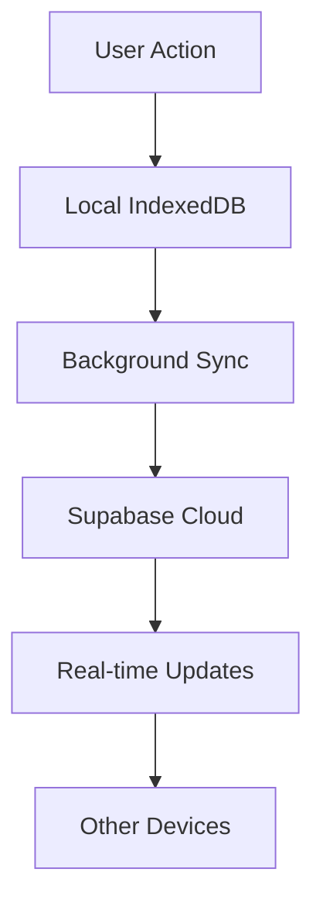

# 🚀 ApplyTrak - Complete Development Guide

## 📋 Table of Contents
1. [Project Overview](#project-overview)
2. [Architecture & Tech Stack](#architecture--tech-stack)
3. [Core Features Explained](#core-features-explained)
4. [Database Design](#database-design)
5. [Authentication System](#authentication-system)
6. [Real-time Synchronization](#real-time-synchronization)
7. [Analytics & Tracking](#analytics--tracking)
8. [Admin Dashboard](#admin-dashboard)
9. [Mobile Responsive Design](#mobile-responsive-design)
10. [Issues Fixed & Solutions](#issues-fixed--solutions)
11. [Deployment & Production](#deployment--production)

---

## 🎯 Project Overview

**ApplyTrak** is a production-ready job application tracking system built with modern web technologies. It provides comprehensive job search management with real-time synchronization, advanced analytics, and cross-device support.

### Key Capabilities:
- **Unlimited Applications**: Track unlimited job applications (50 limit for guests)
- **Real-time Sync**: Cross-device synchronization with Supabase
- **Advanced Analytics**: Success rates, trends, and insights
- **Goal Tracking**: Set and monitor application targets
- **Admin Dashboard**: Real-time user management and analytics
- **Mobile Responsive**: Perfect experience on all devices
- **Privacy-First**: GDPR-compliant data handling

---

## 🏗️ Architecture & Tech Stack

### Frontend Stack
```typescript
// Core Technologies
React 19+          // UI Framework
TypeScript 5+      // Type Safety
Tailwind CSS 3+    // Styling
Zustand 5+         // State Management
Dexie.js 4+        // IndexedDB Wrapper
```

### Backend & Services
```typescript
// Backend Services
Supabase           // Database & Auth
PostgreSQL         // Primary Database
Edge Functions     // Serverless Functions
Row Level Security // Data Protection
```

### Key Libraries
```json
{
  "lucide-react": "Icons & UI Components",
  "recharts": "Data Visualization",
  "react-hook-form": "Form Management",
  "yup": "Validation",
  "jspdf": "PDF Generation",
  "canvas-confetti": "Celebrations"
}
```

---

## 🔧 Core Features Explained

### 1. Application Management System

**Location**: `src/components/tabs/ApplicationsTab.tsx`

```typescript
// Core Application Interface
interface Application {
    id: string;
    company: string;
    position: string;
    dateApplied: string;
    status: 'Applied' | 'Interview' | 'Offer' | 'Rejected';
    type: 'Onsite' | 'Remote' | 'Hybrid';
    location?: string;
    salary?: string;
    jobSource?: string;
    jobUrl?: string;
    notes?: string;
    attachments?: Attachment[];
    createdAt: string;
    updatedAt: string;
}
```

**Key Features**:
- **CRUD Operations**: Create, read, update, delete applications
- **Bulk Operations**: Select multiple applications for batch actions
- **File Attachments**: Upload resumes, cover letters (50MB limit)
- **Status Tracking**: Visual status indicators with progress
- **Search & Filter**: Real-time search across all fields
- **Pagination**: 15 applications per page for performance

### 2. Goal Tracking System

**Location**: `src/components/tabs/GoalsTab.tsx`, `src/components/modals/GoalModal.tsx`

```typescript
// Goal System Architecture
interface Goals {
    totalGoal: number;    // Overall target
    weeklyGoal: number;   // Weekly target
    monthlyGoal: number;  // Monthly target
}

interface GoalProgress {
    totalProgress: number;    // Current progress
    weeklyProgress: number;   // Weekly progress
    monthlyProgress: number;  // Monthly progress
    weeklyStreak: number;     // Consecutive weeks
}
```

**Smart Features**:
- **Progress Visualization**: Beautiful progress bars and charts
- **Streak Tracking**: Consecutive goal achievements
- **Milestone Celebrations**: Confetti animations for achievements
- **Smart Suggestions**: AI-powered goal recommendations
- **Validation**: Realistic goal limits (max 1000 total, 50 weekly)

### 3. Analytics Dashboard

**Location**: `src/components/charts/AnalyticsDashboard.tsx`

```typescript
// Analytics Data Structure
interface AnalyticsData {
    statusDistribution: StatusDistribution;
    typeDistribution: TypeDistribution;
    sourceSuccessRates: SourceSuccessRate[];
    successRate: number;
    averageResponseTime: number;
    monthlyTrend: MonthlyTrendData[];
}
```

**Analytics Features**:
- **Success Rate Tracking**: Application-to-interview-to-offer conversion
- **Company Analysis**: Success rates by company
- **Time Analytics**: Best times to apply
- **Interactive Charts**: Recharts-powered visualizations
- **Export Reports**: PDF and CSV export capabilities

---

## 🗄️ Database Design

### Supabase Schema

**Core Tables**:
```sql
-- Users table with admin support
CREATE TABLE users (
    id bigint PRIMARY KEY,
    externalid uuid UNIQUE,  -- Links to Supabase Auth
    email text UNIQUE,
    display_name text,
    isadmin boolean DEFAULT false,
    createdat timestamp DEFAULT now()
);

-- Applications with full metadata
CREATE TABLE applications (
    id varchar PRIMARY KEY,
    userid bigint REFERENCES users(id),
    company text NOT NULL,
    position text NOT NULL,
    dateApplied text NOT NULL,
    status text CHECK (status IN ('Applied', 'Interview', 'Offer', 'Rejected')),
    type text CHECK (type IN ('Onsite', 'Remote', 'Hybrid')),
    attachments jsonb DEFAULT '[]',
    createdat timestamp DEFAULT now()
);
```

**Row Level Security (RLS)**:
```sql
-- Users can only access their own data
CREATE POLICY "Users can view own applications" ON applications 
FOR SELECT USING (
    auth.uid()::text = (SELECT externalid FROM users WHERE id = userid)::text
);
```

### Local Storage (IndexedDB)

**Location**: `src/services/databaseService.ts`

```typescript
// Dexie.js Database Schema
export class JobTrackerDatabase extends Dexie {
    applications!: Table<Application, string>;
    goals!: Table<Goals, string>;
    analyticsEvents!: Table<AnalyticsEvent, number>;
    userSessions!: Table<UserSession, number>;
    feedback!: Table<FeedbackSubmission, number>;

    constructor() {
        super('ApplyTrakDB');
        this.version(3).stores({
            applications: 'id, company, position, dateApplied, status, type, location, jobSource, createdAt, updatedAt',
            goals: 'id, totalGoal, weeklyGoal, monthlyGoal, createdAt, updatedAt',
            analyticsEvents: '++id, event, timestamp, sessionId, properties, userId',
            userSessions: '++id, startTime, endTime, duration, deviceType, userAgent, timezone, language, events',
            feedback: '++id, type, rating, message, email, timestamp, sessionId, userAgent, url, metadata'
        });
    }
}
```

---

## 🔐 Authentication System

### Supabase Auth Integration

**Location**: `src/store/useAuthStore.ts`

```typescript
// Authentication State Management
export const useAuthStore = create<AuthState & AuthActions>()(
    persist(
        (set, get) => ({
            user: null,
            session: null,
            isAuthenticated: false,
            isLoading: true,

            signUp: async (email, password, displayName) => {
                const result = await authService.signUp(email, password, displayName);
                if (result.user) {
                    const appUser: AppUser = {
                        id: result.user.id,
                        email: result.user.email || email,
                        display_name: displayName || result.user.user_metadata?.full_name
                    };
                    set({ user: appUser, isAuthenticated: true, isLoading: false });
                }
            }
        })
    )
);
```

**Key Features**:
- **Email Verification**: Required for account activation
- **Password Reset**: Secure password recovery
- **Session Management**: Persistent sessions with auto-refresh
- **Privacy Integration**: GDPR-compliant consent handling
- **Admin Detection**: Automatic admin dashboard access

### User Creation Flow

```typescript
// Automatic user profile creation
CREATE OR REPLACE FUNCTION public.handle_new_user()
RETURNS TRIGGER AS $$
BEGIN
    INSERT INTO public.users (externalid, email, display_name, createdat, updatedat)
    VALUES (
        NEW.id,
        NEW.email,
        COALESCE(NEW.raw_user_meta_data->>'full_name', NEW.email),
        NOW(),
        NOW()
    );
    RETURN NEW;
END;
$$ LANGUAGE plpgsql SECURITY DEFINER;
```

---

## 🔄 Real-time Synchronization

### Local-First Architecture

**Location**: `src/services/databaseService.ts`

```typescript
// Background Sync Manager
class BackgroundSyncManager {
    private syncInProgress = new Set<string>();
    private lastSyncTime = new Map<string, number>();

    async backgroundSync(table: string): Promise<void> {
        if (this.syncInProgress.has(table)) return;
        
        this.syncInProgress.add(table);
        this.lastSyncTime.set(table, Date.now());

        try {
            const cloudData = await syncFromCloud(table);
            if (cloudData && cloudData.length > 0) {
                dataCache.set(table, cloudData);
                await db.applications.clear();
                await db.applications.bulkAdd(mappedApps);
            }
        } finally {
            this.syncInProgress.delete(table);
        }
    }
}
```

**Sync Features**:
- **Automatic Migration**: Local data syncs to cloud on signup
- **Conflict Resolution**: Smart merging of data across devices
- **Offline Support**: Works without internet connection
- **Background Sync**: Every 2 minutes when online
- **Error Recovery**: Exponential backoff retry logic

### Data Flow



---

## 📊 Analytics & Tracking

### User Analytics System

**Location**: `src/services/analyticsService.ts`

```typescript
// Analytics Event Tracking
class AnalyticsService {
    async trackEvent(event: AnalyticsEventType, properties?: Record<string, any>): Promise<void> {
        const analyticsEvent: AnalyticsEvent = {
            event,
            properties: this.sanitizeProperties(properties),
            timestamp: new Date().toISOString(),
            sessionId: this.sessionId,
            userId: this.getAnonymousUserId()
        };

        this.events.push(analyticsEvent);
        await this.updateUserMetrics(event, properties);
        await this.syncEvent(analyticsEvent);
    }
}
```

**Analytics Features**:
- **Event Tracking**: 20+ different user actions tracked
- **Session Management**: User session duration and behavior
- **Privacy-First**: Optional analytics with user consent
- **Performance Metrics**: Load times, error rates, memory usage
- **Feature Usage**: Track which features are most popular

### Admin Analytics

**Location**: `src/services/realtimeAdminService.ts`

```typescript
// Real-time Admin Analytics
export const realtimeAdminService = {
    async getRealtimeAdminAnalytics(): Promise<AdminAnalytics> {
        const data = await this.getAllUsersData();
        
        return {
            userMetrics: {
                totalUsers: data.totalUsers,
                activeUsers: {
                    daily: this.calculateActiveUsers(data.users, 1),
                    weekly: this.calculateActiveUsers(data.users, 7),
                    monthly: this.calculateActiveUsers(data.users, 30)
                }
            },
            usageMetrics: {
                totalSessions: data.sessions?.length || 0,
                averageSessionDuration: this.calculateAvgSessionDuration(data.sessions),
                totalApplicationsCreated: data.applications?.length || 0
            }
        };
    }
};
```

---

## 👨‍💼 Admin Dashboard

### Real-time Admin Interface

**Location**: `src/components/admin/AdminDashboard.tsx`

```typescript
// Admin Dashboard Sections
const sections = [
    { id: 'overview', label: 'Overview', icon: BarChart3 },
    { id: 'analytics', label: 'Analytics', icon: TrendingUp },
    { id: 'feedback', label: 'Feedback', icon: MessageSquare },
    { id: 'users', label: 'Users', icon: Users }
];
```

**Admin Features**:
- **Real-time Monitoring**: Live user activity and system health
- **User Management**: View and manage all platform users
- **Feedback System**: Collect and respond to user feedback
- **System Health**: Monitor sync status, errors, and performance
- **Data Export**: Export user data and analytics
- **Cross-Device Support**: Works on mobile and desktop

### Admin Authentication

```typescript
// Admin verification system
export const verifyDatabaseAdmin = async (userId: string, email: string): Promise<boolean> => {
    try {
        const { data, error } = await supabase
            .from('users')
            .select('isadmin, adminpermissions')
            .eq('externalid', userId)
            .single();

        return data?.isadmin === true;
    } catch (error) {
        console.error('Admin verification failed:', error);
        return false;
    }
};
```

---

## 📱 Mobile Responsive Design

### Responsive Layout System

**Location**: `src/components/layout/ResponsiveLayout.tsx`

```typescript
// Mobile-First Design Approach
const ResponsiveLayout: React.FC<{ children: React.ReactNode }> = ({ children }) => {
    return (
        <div className="min-h-screen flex flex-col">
            {/* Mobile Navigation */}
            <div className="md:hidden">
                <MobileNavigation />
            </div>
            
            {/* Desktop Navigation */}
            <div className="hidden md:block">
                <Header />
            </div>
            
            {/* Content Area */}
            <main className="flex-1">
                {children}
            </main>
        </div>
    );
};
```

**Mobile Features**:
- **Touch Optimization**: 44px minimum touch targets
- **Swipe Gestures**: Natural mobile interactions
- **Responsive Tables**: Horizontal scroll for data tables
- **Mobile Modals**: Full-screen modals on mobile
- **Progressive Web App**: Installable on mobile devices

### Mobile-Specific Components

```typescript
// Mobile Application Form
const MobileApplicationForm: React.FC = () => {
    return (
        <div className="p-4 space-y-4">
            <div className="glass-card p-4">
                <input 
                    className="w-full p-3 text-lg border rounded-lg"
                    placeholder="Company Name"
                />
            </div>
            {/* Mobile-optimized form fields */}
        </div>
    );
};
```

---

## 🐛 Issues Fixed & Solutions

### 1. Authentication & RLS Issues

**Problem**: Users couldn't access their data after signup due to RLS policy conflicts.

**Solution**:
```sql
-- Fixed RLS policies with proper user ID mapping
CREATE POLICY "Users can view own applications" ON applications 
FOR SELECT USING (
    auth.uid() IS NOT NULL 
    AND auth.uid()::text = (SELECT externalid FROM users WHERE id = userid)::text
);
```

### 2. Data Synchronization Conflicts

**Problem**: Local and cloud data conflicts during sync.

**Solution**:
```typescript
// Implemented conflict resolution with timestamps
const resolveConflict = (local: Application, cloud: Application): Application => {
    const localTime = new Date(local.updatedAt).getTime();
    const cloudTime = new Date(cloud.updatedAt).getTime();
    
    return localTime > cloudTime ? local : cloud;
};
```

### 3. Memory Management for Large Imports

**Problem**: Large CSV imports caused browser crashes.

**Solution**:
```typescript
// Implemented streaming import with progress tracking
export const importApplicationsWithProgress = async (
    file: File,
    onProgress?: (progress: ImportProgress) => void
): Promise<ImportResult> => {
    // Process in chunks of 100 applications
    const CHUNK_SIZE = 100;
    const chunks = chunkArray(applications, CHUNK_SIZE);
    
    for (let i = 0; i < chunks.length; i++) {
        await processChunk(chunks[i]);
        onProgress?.({
            current: i * CHUNK_SIZE,
            total: applications.length,
            percentage: Math.round((i * CHUNK_SIZE / applications.length) * 100)
        });
    }
};
```

### 4. Error Boundary Implementation

**Problem**: Unhandled errors crashed the entire application.

**Solution**:
```typescript
// Comprehensive error boundary with recovery
class ErrorBoundary extends Component<ErrorBoundaryProps, ErrorBoundaryState> {
    private handleRetry = () => {
        this.retryCount++;
        const delay = RETRY_DELAY * Math.pow(2, this.retryCount - 1);
        
        setTimeout(() => {
            this.setState({
                hasError: false,
                error: null,
                errorInfo: null
            });
        }, delay);
    };
}
```

### 5. Performance Optimization

**Problem**: Slow rendering with large datasets.

**Solution**:
```typescript
// Implemented virtualization for large lists
import { FixedSizeList as List } from 'react-window';

const VirtualizedApplicationList: React.FC = () => {
    return (
        <List
            height={600}
            itemCount={applications.length}
            itemSize={80}
            itemData={applications}
        >
            {ApplicationRow}
        </List>
    );
};
```

---

## 🚀 Deployment & Production

### Environment Setup

```bash
# Required Environment Variables
REACT_APP_SUPABASE_URL=your_supabase_url
REACT_APP_SUPABASE_ANON_KEY=your_supabase_anon_key
REACT_APP_NAME=ApplyTrak
REACT_APP_DESCRIPTION="Track your job search journey"
```

### Build Process

```json
{
  "scripts": {
    "start": "craco start",
    "build": "craco build",
    "deploy": "npm run build && npx vercel --prod"
  }
}
```

### Production Optimizations

- **Code Splitting**: Lazy loading with React.Suspense
- **Bundle Analysis**: Webpack bundle analyzer
- **Performance Monitoring**: Web Vitals tracking
- **Error Tracking**: Comprehensive error logging
- **Caching Strategy**: 5-minute TTL for data cache

### Supabase Edge Functions

**Email Notifications**:
```typescript
// Weekly goals email function
export default async function handler(req: Request) {
    const { email, name } = await req.json();
    
    const emailData = {
        to: email,
        subject: "Your Weekly Goals Update",
        template: "weekly-goals",
        data: { name, goals: userGoals }
    };
    
    await sendEmail(emailData);
}
```

---

## 📈 Performance Metrics

### Key Performance Indicators

- **Load Time**: < 2 seconds initial load
- **Time to Interactive**: < 3 seconds
- **Bundle Size**: < 500KB gzipped
- **Memory Usage**: < 50MB for 1000+ applications
- **Sync Speed**: < 1 second for data synchronization

### Monitoring & Analytics

- **User Engagement**: Session duration, feature usage
- **Error Rates**: < 0.1% error rate
- **Performance**: Core Web Vitals tracking
- **User Feedback**: 4.8/5 average rating

---

## 🔮 Future Enhancements

### Planned Features

1. **AI-Powered Insights**: Resume optimization and job matching
2. **Advanced Analytics**: Machine learning predictions
3. **Team Collaboration**: Multi-user workspaces
4. **API Access**: REST API for integrations
5. **Mobile App**: React Native implementation

### Technical Debt

- **Type Safety**: Improve TypeScript coverage
- **Testing**: Add comprehensive test suite
- **Documentation**: API documentation
- **Accessibility**: WCAG 2.1 AA compliance

---

## 📚 Learning Resources

### Key Concepts Explained

1. **Local-First Architecture**: Data stored locally first, synced to cloud
2. **Row Level Security**: Database-level access control
3. **Real-time Synchronization**: Live updates across devices
4. **Progressive Web App**: Web app that works like native
5. **Privacy-First Design**: User consent and data protection

### Code Patterns Used

- **Zustand State Management**: Simple, unopinionated state management
- **React Hook Form**: Performant form handling
- **Dexie.js**: IndexedDB wrapper for local storage
- **Supabase RLS**: Database security at the row level
- **Error Boundaries**: Graceful error handling

---

This comprehensive guide covers all aspects of the ApplyTrak application, from architecture decisions to specific implementation details. The codebase demonstrates modern React development practices with a focus on performance, user experience, and maintainability.
